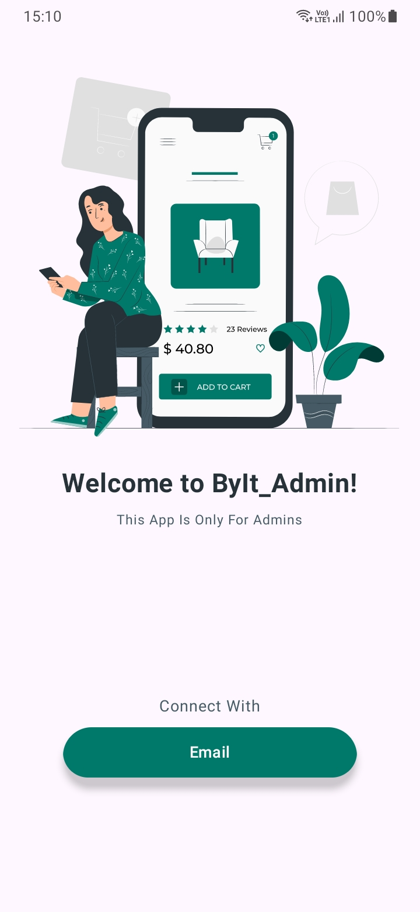
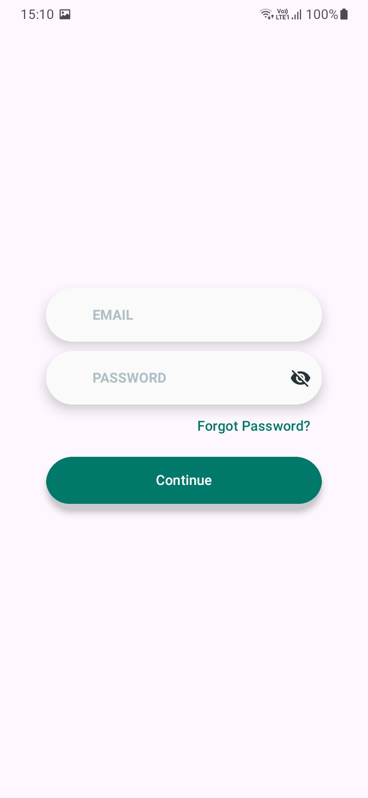
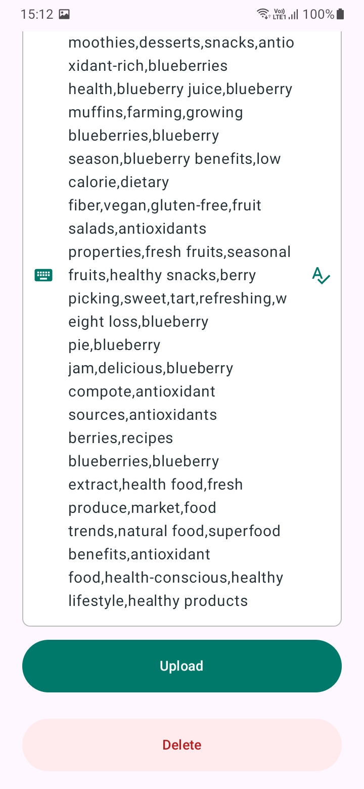

# 🛒 Byit! Admin App

**Byit! Admin App** is the administrative counterpart to the Byit! Grocery List App, specifically designed for managing grocery data and overseeing app content. This app is restricted to approved administrators only. Normal users cannot sign in, and any user who wishes to gain admin access must submit a formal request through the **User App**.

At present, admins can add, update, and delete grocery items. Support for resolving customer issues will be available in a future update, though its release may be delayed.

---

## 📲 Project Overview

The **Byit! Admin App** empowers approved administrators with tools to:

- Manage grocery items by adding, updating, or deleting items.
- Organize item descriptions, categories, images, prices, and ratings to enhance user accessibility.
- Ensure effective grocery searchability by managing keywords, improving the overall user shopping experience in the Byit! User App.

**Note**: This app is **admin-only**. Misuse of admin privileges, such as unauthorized access or data tampering, is discouraged, as it may directly impact the user experience.

---

## 🔑 Access Requirements

### Admin Access Request

To gain admin access, users must:

1. **Sign up** in the **User App** and then **sign in** to the **Admin App** using the same credentials.
2. **Submit an Access Request**: After signing in, users will see an invitation letter on the home screen. They must accept the terms and click **Request Admin Access**.
3. Use a **valid and accessible email** to facilitate communication.

---

## 📱 App Screenshots

### Portrait Mode Overview

<table align="center"> <tr> <td align="center"><br /><strong>Welcome Screen</strong></td> <td align="center"><br /><strong>Login Screen</strong></td> <td align="center"><br /><strong>Upload Screen 1</strong></td> </tr> <tr> <td align="center"><br /><strong>Upload Screen 2</strong></td> </tr> </table>

---

## 🚀 Admin Features

### 1. Item Management

- **Add New Items**: Admins can add items with the necessary details, such as description, price, category, and images.
- **Update Existing Items**: Retrieve item details by entering the item name in the text box. A cloud download icon will appear, which, when clicked, downloads the item data for editing.
- **Delete Items**: Quickly remove items from the database with the delete button, located at the end of each item screen when user retrieves the data from cloud using cloud download button.

### 2. Item Information Guidelines

- **Description**: Item descriptions must be between 30-60 characters, concisely describing the product.
- **Category Selection**: Choose the correct type and category for accurate placement, ensuring users find items easily in the User App.
- **Price and Rating**: Input item price and a star rating to help users make informed decisions.
- **Search Keywords**: Minimum of 50 keywords per item is required for better search accuracy. Avoid misleading keywords as they may negatively impact user searches.
- **Image Uploads**: Each item must include one image( transparent PNG is preferred ).

---

## ⚠️ Important Usage Information

- **Customer Support**: Customer issue resolution is **currently unavailable**. While planned, this feature may be delayed in its release.
- **Data Accuracy**: Admins are encouraged to use only verified information to maintain data accuracy.
- **Admin Responsibility**: Only approved admins have data access; misuse of admin privileges can result in restricted access.

---
## 🛠️ Setup and Installation

1. **Clone the Repository**  
   ```bash
   git clone https://github.com/your-username/byit-grocerylist-app.git
   cd byit-grocerylist-app
   ```
   
 1. **Open in Android Studio**
	- Open the project in Android Studio.
	  
 3. **Install Dependencies**
	- **Build the Project**
    - Go to `Build` > `Rebuild Project`.
      
4.  **Run the App**
    - Connect an Android device or use an emulator.
    - Run the app by clicking the `Run` button or pressing `Shift + F10`.
      
5. **Output APK**
    - The output APK can be found at `outputs/apk/debug/app-debug.apk`. You can install this APK on your Android device to use the app.


---

## 🤝 Contribution Guidelines

We encourage contributions from the community! Here's how you can contribute to this project:

1. **Fork the Repository**  
    Click the `Fork` button at the top right of the repository page to create your own copy of the repository.
    
2. **Create a New Branch**  
    Create a new branch for your feature or bug fix:
    
    ```shell
    git checkout -b feature-name
    ```
    
3. **Make Your Changes**  
    Implement your changes and ensure that they align with the project's coding standards.
    
4. **Commit Your Changes**  
    Commit your changes with a descriptive message:
    
    ```shell
     git commit -m "Implemented feature X or fixed bug Y"
    ```
    
5. **Push Your Changes**  
    Push your branch to your repository:
    
    ```shell
     git push origin feature-name
    ```
    
6. **Submit a Pull Request**  
    Go to the original repository on GitHub and submit a pull request. Provide details about the changes you made.
    

## 📜 Attribution & License

- **Image Credits:** Thanks to [lottiefiles.com](https://lottiefiles.com/) and [SVGRepo](https://www.svgrepo.com) for some of the icons and images used in this app.
- **Disclaimer:** If any copyrighted images are used unintentionally, please inform us, and we will promptly remove them.
- **Open Source:** This app is open-source, and anyone is welcome to use, modify, or contribute to the codebase.


---

## 🌍 Future Updates

- **Customer Support Module**: Adding functionality for admins to address customer inquiries directly from the Admin App.
- **Data Optimization**: Improving performance for faster data handling and minimal lag.
- **UI Refinements**: Enhancing the design for a smoother admin experience.
- **Additional Item Fields**: Introducing more fields for advanced item management.

The **Byit! Admin App** strives to create a seamless experience for admins, aiding them in effectively managing grocery data for all Byit! users.


---
## 📞 Contact Information

For any questions or support, please contact:

- **Name:** Sai Pavan Kiran
- **GitHub:** [SaiPavanKiran](https://github.com/SaiPavanKiran)


